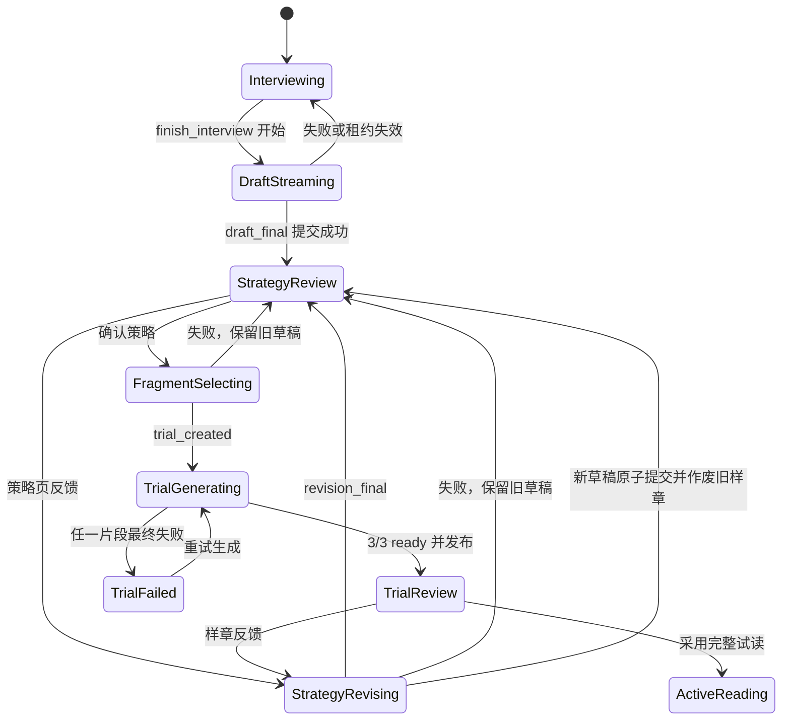

# 阅读准备与试读流程渐进式展示实施方案

> 本文件是一份可直接执行的实施规范，基于本地 `main` 的 `06fb00e` 状态整理。
> 符号名是实现定位的主要依据，行号只作为辅助参考。

## 0. 范围与目标

### 0.1 覆盖流程

本方案覆盖以下完整闭环：

```text
访谈最后一答
  -> 流式生成读前简报、临时策略、三个阅读节点
  -> 临时策略确认
  -> 流式确定三个试读切片
  -> 三段原文逐段出现
  -> 三段裁读结果逐段回填
  -> 样章确认或提交反馈
  -> 流式生成修订后的临时策略
  -> 再次确认并生成新一轮样章
```

同时覆盖策略确认页直接提交反馈的路径。策略页反馈和样章反馈必须复用同一套策略修订能力。

### 0.2 用户体验目标

1. 长时间模型调用开始后，页面在首个可识别工具调用事件到达时立即进入对应的渐进视图。
2. 用户不再等待整个工具调用、三个切片或三段裁读全部完成后才看到内容。
3. 三个试读槽位尺寸和顺序固定，状态从“定位中”逐步变成“原文已选”“裁读中”“完成”。
4. 单段裁读结果完成后，在已经展示的原文原地加入导读、裁读注和节后助读，不替换整页。
5. 样章反馈生成新策略期间，旧样章继续保持权威且可恢复；只有新策略成功提交后才作废旧样章。
6. 所有正式操作仍受持久化状态约束，临时流内容不能提前获得确认、采用或反馈权限。

### 0.3 非目标

1. 不做单个片段内部的 annotation token 级逐条落库。每个 worker 返回完整、校验通过的片段结果后再一次性回填该段。
2. 不改变正式策略创建时机。正式策略仍只在用户采用完整试读后创建。
3. 不允许只完成部分片段时采用策略。
4. 不把试读生成迁移进 reading setup agent；worker 仍负责裁读生成。
5. 不要求刷新后重放已经流过的每个字符。刷新恢复以持久化 operation 和权威快照为准。

## 1. 当前基线与主要阻塞点

### 1.1 访谈结束

- `finish_interview` 已经一次性产出本书画像、读前简报、公开策略和包含三个 `trial_candidates` 的结构化策略。
- `createInterviewStreamParser` 能识别 `finish_interview`，但不解析其参数，只在工具成功后发 `concluding`。
- API 会扣住 `concluding`，直到 interview session、画像和策略草稿在同一事务中提交成功。
- `InterviewPage` 只能展示固定的“正在生成读前简报”，提交完成后依赖 workflow gate 跳到策略页。
- `StrategySnapshot` 丢弃服务端已有的 `draft.strategy.trialCandidates`，刷新后无法展示已选阅读节点。

### 1.2 策略确认到试读

- `POST /strategy/approve` 会同步等待 `select_trial_fragments` 完整返回三个片段。
- 三个片段全部选完后，宿主才创建 trial revision、三个 trial segment 和三个 generation job。
- 因此切片阶段没有 revision，也没有三个可查询槽位；页面只能停留在策略按钮 loading。

### 1.3 试读生成

- revision 创建后，`trialState` 已经可以切出并返回三个片段的 `originalHtml`。
- API 在 revision 未 `published` 时故意隐藏每个 generation result。
- Web mapper 又在未发布时把 `samples` 直接映射为空数组。
- worker 实际上已经逐段写入 `node_generations.status=ready` 和完整 `result`，最后一段完成时才发布整个 revision。

### 1.4 样章反馈回跳

- `TrialPage` 提交反馈后会等待完整策略修订请求结束，成功后才跳转策略页。
- `reviseFromFeedback` 在模型调用成功前不修改旧 trial；成功后在一个事务中 supersede 旧 trial、保存新 draft、增加调整次数并回到 `strategy_review`。
- 该事务边界必须保留，但模型调用过程需要变成可观测的渐进流。
- 当前策略修订沿用原读前简报，只更新公开策略、结构化策略和可能变化的阅读节点。

## 2. 核心设计决策

### 2.1 区分临时展示与权威提交

所有来自 tool-call argument partial JSON 的内容都是 speculative：

- 可以立即展示；
- 不能写入正式草稿字段；
- 不能开放确认、反馈或采用按钮；
- 工具执行、业务校验或最终事务失败时必须可丢弃；
- 只有 `*_final` 事件携带的服务端快照才是权威数据。

### 2.2 保留现有业务工作流状态

不向 `userBooks.workflowStatus` 增加 `strategy_revising` 或 `trial_selecting`。

原因：

1. 这两个状态描述的是长请求运行状态，不是已经提交的业务阶段。
2. 样章反馈修订期间必须保持 `trial_review`，旧样章在新策略提交成功前仍有效。
3. 试读切片失败时必须保持 `strategy_review`，用户可以重新确认或继续修改策略。
4. 现有 workflow pointer check 和路由 gate 可以继续使用。

临时运行状态由 `reading_setup_operations` 和客户端渐进状态表达。

### 2.3 展示渐进，发布与采用仍然原子

把原来的“试读 all-or-nothing”拆成两条规则：

- 展示规则：三个原文和已经完成的单段裁读结果可以逐段展示。
- 业务规则：revision 发布、反馈入口、正式采用仍要求三个片段全部 ready。

相关 PRD、架构文档和 `core_flow_refactor.md` 中“不展示部分结果”的旧表述需要同步修改。

### 2.4 阅读节点与精确切片是两个阶段

- `finish_interview` / `save_strategy_draft` 选择的是恰好三个阅读节点。
- `select_trial_fragments` 只能在这三个节点内确定精确 block range，并补充 threshold / typical / hardest 标签。
- 策略页展示“已选阅读节点”；样章生成页展示“正在为这三个节点确定切片范围”。

### 2.5 样章反馈不重写读前简报

沿用当前行为：

- 首次访谈结束流式生成读前简报。
- 策略页反馈和样章反馈只修订公开策略、结构化策略及阅读节点。
- 临时策略修订视图直接显示旧简报，不对简报做 loading 或重新流式生成。

如果未来要允许反馈重写简报，应作为独立产品需求修改 agent schema 和持久化逻辑。

## 3. 目标状态流



其中 `DraftStreaming`、`StrategyRevising` 和 `FragmentSelecting` 是 UI/operation 状态，不进入 `userBooks.workflowStatus`。

## 4. 长操作持久化与租约

### 4.1 新表 `reading_setup_operations`

新增一张只记录策略修订和试读切片命令的表。访谈 turn 继续使用现有 `interview_sessions.turnLease*`。

建议字段：

```text
id                              uuid primary key
user_book_id                    uuid not null
kind                            strategy_revision | trial_selection
source                          strategy_feedback | trial_feedback | strategy_approve
base_strategy_draft_version_id  uuid not null
base_trial_revision_id          uuid null
idempotency_key                 text not null
request_hash                    text not null
payload                         jsonb not null
status                          pending | running | completed | failed
attempt_count                   integer not null default 0
lease_id                        uuid null
lease_claimed_at                timestamptz null
lease_expires_at                timestamptz null
result_strategy_draft_version_id uuid null
result_trial_revision_id        uuid null
error_summary                   text null
created_at                      timestamptz not null
updated_at                      timestamptz not null
completed_at                    timestamptz null
```

约束与索引：

1. `unique(user_book_id, idempotency_key)`，保证同一客户端命令只产生一个 operation。
2. 每本书最多一个 `pending/running` operation 的 partial unique index。
3. lease 三字段必须全空或全有。
4. `completed` 的结果 pointer 必须与 kind 匹配：`strategy_revision` 必须有且只能有 result draft，`trial_selection` 必须有且只能有 result trial revision。
5. `failed` 必须有 `error_summary`。
6. 只有 `trial_feedback` 必须且可以绑定 `base_trial_revision_id`；其他 source 必须为 null。
7. kind/source 必须精确匹配：`trial_selection <-> strategy_approve`，`strategy_revision <-> strategy_feedback | trial_feedback`。
8. 幂等重放时必须重新计算 `request_hash`；同一个 key 绑定了不同 feedback、base draft 或 base trial 时返回 409。
9. `completed/failed` 必须清空 lease 三字段；`completed_at` 只允许 terminal 状态非空。

### 4.2 为什么需要 operation

SSE 连接可能在模型调用期间断开。若只依赖浏览器 mutation 状态：

- 刷新后无法知道策略修订或切片是否仍在运行；
- 用户可能重复提交相同反馈；
- 两个请求可能并行调用模型，最终只有一个 CAS 提交成功；
- 无法在 lease 过期后安全恢复。

operation 只持久化命令状态和最终 pointer，不持久化每个字符。正常连接看到完整流；刷新后看到 skeleton，并通过 operation 状态等待最终快照或在 lease 过期后恢复。

### 4.3 operation 生命周期

1. 端点先完成用户书籍权限和输入格式校验，但不能先用当前 workflow/base pointer 拒绝请求。
2. 按 `user_book_id + idempotency_key` 读取 operation，并重新计算 `request_hash`。
3. 已存在且 hash 不同返回 409；已存在且 `completed` 时直接按结果 pointer 返回最终快照，不再检查已经变化的 workflow/base pointer。
4. operation 不存在时，才检查当前 workflow、base draft/trial、调整上限，并尝试插入 `pending` operation；partial unique 冲突时返回当前 pending/running operation 摘要。
5. `pending/failed` 或过期 `running` operation 在 claim 前必须重新校验其 base draft/trial 仍是当前 pointer、workflow 仍允许该 source、调整次数仍未达上限。stale operation 返回 409，不得重新调用 agent；校验通过后才能原子 claim 新 lease。claim 时 `attempt_count + 1`，清空旧 error/terminal 字段；本次 SSE 使用新的 `operationAttempt`。
6. 当前 lease 持有者负责调用 agent，并以不超过 lease TTL 三分之一的间隔续租。续租必须使用 `operation.id + lease_id + status=running` 条件；续租失败后立即停止发送业务 delta，当前 attempt 不得提交。
7. agent 超时必须小于 lease TTL，且留出至少一次续租失败检测的余量。进程存活且调用正常时不能仅因固定 TTL 被其他请求 reclaim。
8. 最终业务事务使用 `operation.id + lease_id + attempt_count + base pointers` 作为 fencing 条件。
9. 成功事务同时写业务结果、清空 lease 并置 `operation=completed`。
10. 模型或业务校验失败只把 operation 标记为 failed，不修改当前 draft/trial pointers；lease 丢失不把 operation 标记为 failed，由新 attempt 接管。
11. 旧 JSON 端点和新 stream 端点必须调用同一 operation service。JSON 端点只是不转发中间 delta，不能绕过 pending/running operation 约束另起 agent 调用。

客户端在一次用户命令开始时生成 `idempotencyKey`，并持续复用到该命令 completed，或 failed 后用户明确重新提交。网络重试、HTTP/SSE fallback 和 resume 不能临时生成新 key；收到 `operationId` 后优先使用 operation resume，不再重新提交原命令。本方案不提供运行中取消 operation 的能力。

### 4.4 恢复查询

新增：

```text
GET /v1/user-books/:id/reading-setup-operation/current
GET /v1/user-books/:id/reading-setup-operation/:operationId
```

返回与当前 workflow pointer 相关的 operation 摘要或 `null`。选择顺序固定为：

1. 返回唯一的 `pending/running` operation；
2. workflow 为 `strategy_review` 时，匹配 completed 的 `resultDraftId=currentStrategyDraftVersionId`，或 failed 的 `baseDraftId=currentStrategyDraftVersionId` 且 `baseTrialRevisionId=null`；
3. workflow 为 trial 相关状态时，匹配 completed 的 `resultTrialRevisionId=currentTrialRevisionId`，或 failed 的 `baseTrialRevisionId=currentTrialRevisionId`；
4. 多条 terminal 同时匹配时按 `updated_at desc, id desc` 取一条。由于同书只能串行运行 operation，后一个合法命令的 terminal 时间必须晚于前一个；
5. 当前 workflow 已离开阅读准备闭环时返回 `null`，不能用历史 completed operation 触发旧页面跳转。

公开摘要：

```ts
{
  operationId: string;
  operationAttempt: number;
  kind: 'strategy_revision' | 'trial_selection';
  source: 'strategy_feedback' | 'trial_feedback' | 'strategy_approve';
  status: 'pending' | 'running' | 'completed' | 'failed';
  baseDraftId: string;
  baseTrialRevisionId: string | null;
  resultDraftId: string | null;
  resultTrialRevisionId: string | null;
  canResume: boolean;
  errorSummary: string | null;
  recoverableInput: { feedback: string } | null;
}
```

`recoverableInput` 只对当前用户、当前书且状态为 pending/running/failed 的 feedback operation 返回原 feedback，不返回完整内部 payload，也不能写入日志。approve 和 completed operation 返回 `null`。Web 以该字段恢复刷新前输入，不能依赖组件内 state。

`/current` 按上述规则选择与当前 workflow 相关的 operation；`/:operationId` 读取指定 operation 的同一公开摘要，并校验该 operation 属于当前用户和当前书。客户端已知 operationId 后轮询 detail endpoint；页面首次加载且不知道 operationId 时先查询 `/current`。

页面刷新后不重放字符：

- `pending/running`：展示相应 skeleton 并轮询 operation detail。
- `canResume`：自动调用对应 resume stream。
- `completed`：读取权威 strategy/trial snapshot 并按 workflow 跳转。
- `failed`：恢复旧页面和原输入，允许重试。

## 5. Agent 增量解析

### 5.1 重构 parser

将 `createInterviewStreamParser` 扩展为按工具分发的 `createReadingSetupStreamParser`。

`completeJson` 会主动补齐未闭合的字符串、数组和对象，只适合从 partial buffer 中提取可继续增长的字符串字段，不能用来判断 candidate/fragment 已经完整。新增原始 JSON 边界扫描器，例如 `scanCompletedArrayItems`：逐字符维护 string/escape/object-depth/array-depth；当深度确认目标数组直属元素在原始 buffer 中真实读到闭合 `}` 时，即可截取该元素，交给完整 schema 解析并发送对象事件，不需要等待整个数组闭合。

支持工具：

| 工具 | 增量字段 |
|---|---|
| `present_interview_question` | acknowledgment、prompt、hint、options、sufficiency |
| `finish_interview` | briefing 四段、public_strategy、strategy.trial_candidates |
| `save_strategy_draft` | public_strategy、strategy.trial_candidates |
| `select_trial_fragments` | fragments 数组中的完整 fragment |

### 5.2 调整 `finish_interview` 字段顺序

当前隐藏的本书画像位于用户可见字段之前。工具参数顺序调整为：

```text
briefing
public_strategy
strategy
book_reader_profile
reader_profile_patch
```

parser 不能只依赖字段顺序判断正确性，但顺序用于降低首个可见内容的延迟。

### 5.3 安全增量规则

1. 字符串只发新增后缀，不能重复发送已经发出的字符。
2. briefing 按四个固定 field 分别维护已发长度。
3. 字符串 delta 可以使用 `completeJson` 做 best-effort 解析；candidate/fragment 禁止使用自动补闭合后的 JSON 判断完整性。
4. candidate/fragment 只有在原始 buffer 中确认对象真实闭合、完整 schema 校验通过后才能发送，禁止发送截断的 reason、range、label 或仍可能继续增长的数字 offset。
5. 同一数组元素只发送一次。边界扫描器记录已消费的原始字符位置，不能依赖对象内容相等去重。
6. `trial_candidates` 和 `fragments` 只能按 ordinal 递增发送；ordinal 来自数组位置，不接受 agent 自报 ordinal。
7. parser 在 tool name 缺失时可由字段推断，但推断后必须锁定当前工具。
8. 同一 agent run 内每次新 tool call 开始时递增 `speculativeEpoch`，重置 buffer、边界扫描位置和 emitted state，并先发送 `speculative_reset`。客户端收到更大 epoch 后原子清空上一 tool call 的临时文本、节点、fragment 和槽位状态。
9. 所有临时 delta 都携带当前 `speculativeEpoch`；失败 tool call 的迟到事件不能写入新 epoch。工具执行失败不发送 final，agent 若继续调用新工具则按第 8 条重置；整个 run 最终失败时再由 operation/interview 终态丢弃临时内容。

tool call 结束时仍要对完整 arguments 执行一次权威 schema 和集合校验。增量对象事件只负责临时预览，不能替代最终工具校验。

### 5.4 内部事件

建议将 agent-kit 的内部事件定义为：

```ts
type ReadingSetupStreamDelta =
  | ExistingInterviewQuestionDeltasWithEpoch
  | { type: 'speculative_reset'; speculativeEpoch: number; phase: ReadingSetupPhase }
  | { type: 'draft_started'; speculativeEpoch: number; source: 'interview' | 'revision' }
  | { type: 'briefing_delta'; speculativeEpoch: number; field: BriefingField; chars: string }
  | { type: 'strategy_delta'; speculativeEpoch: number; chars: string }
  | { type: 'reading_node_added'; speculativeEpoch: number; ordinal: number; sectionId: string; segment: number; reason: string }
  | { type: 'selection_started'; speculativeEpoch: number; total: 3 }
  | { type: 'fragment_added'; speculativeEpoch: number; ordinal: number; fragment: TrialFragmentSelection };
```

agent-kit 只发送 agent 原始业务字段。chapter path、原文 HTML、operation id 和权威 snapshot 由 API/service 层补充。

## 6. 对外 SSE 契约

所有非 heartbeat 事件都应携带单调递增的 `sequence`，并绑定 `userBookId` 以及当前
`streamId`，或 `operationId + operationAttempt`。客户端用该 envelope 去重和拒绝迟到事件；下面示例省略重复字段时，
仍视为包含这些公共字段。`sequence` 在每个 stream/attempt 内从 1 开始；观察到更大的 `operationAttempt` 后，客户端必须拒绝旧 attempt 的所有后续事件。

所有 speculative 事件还必须携带单调递增的 `speculativeEpoch`。同一 stream/attempt 内观察到更大 epoch 时，客户端先清空上一 tool call 的 provisional state；epoch 较小的迟到事件直接忽略。final snapshot 不依赖 speculative 内容，始终覆盖当前临时状态。

开流前的权限、格式和无法创建/读取 operation 的错误使用 HTTP 4xx/5xx。开流后的带内错误必须携带完整 envelope，且使用稳定错误码：

```ts
type ReadingSetupStreamErrorCode =
  | 'agent_failed'
  | 'validation_failed'
  | 'lease_lost'
  | 'internal_error';
```

`lease_lost` 表示当前 attempt 已失效但 operation 未必失败，客户端进入 recovering。`agent_failed/validation_failed/internal_error` 只能在当前 lease owner 已把 operation 或 interview turn 持久化为 failed 后发送；客户端仍读取终态确认后再恢复旧页面。transport disconnect 不是业务 `error` 事件。

### 6.1 首次访谈结束

扩展现有 `InterviewStreamEvent`：

```ts
| { type: 'speculative_reset'; streamId: string; speculativeEpoch: number; phase: 'interviewing' }
| { type: 'draft_started'; streamId: string; conversationVersion: number }
| { type: 'briefing_delta'; streamId: string; field: BriefingField; chars: string }
| { type: 'strategy_delta'; streamId: string; chars: string }
| { type: 'reading_node_added'; streamId: string; node: ReadingNodePreview }
| { type: 'draft_final'; streamId: string; strategy: StrategyReviewResponse }
| { type: 'error'; streamId: string; code: ReadingSetupStreamErrorCode; message: string }
```

语义：

- `draft_started` 在识别到 `finish_interview` tool call 时立即发送。
- `draft_final` 只在 interview lease fencing 和保存草稿事务成功后发送。
- `done` 仍作为 turn 结束帧，但客户端以 `draft_final` 的 snapshot 填充策略缓存。
- `concluding` 可以保留兼容，后续在前端迁移完成后删除或降为纯文案事件。

### 6.2 策略修订流

新增共享事件类型 `StrategyRevisionStreamEvent`，由策略页反馈和样章反馈共同使用：

```ts
type StrategyRevisionStreamEvent =
  | { type: 'speculative_reset'; operationId: string; speculativeEpoch: number; phase: 'strategy_review' }
  | {
      type: 'revision_started';
      operationId: string;
      source: 'strategy_feedback' | 'trial_feedback';
      baseDraftId: string;
      baseTrialRevisionId: string | null;
    }
  | { type: 'strategy_delta'; operationId: string; chars: string }
  | { type: 'reading_node_added'; operationId: string; node: ReadingNodePreview }
  | { type: 'revision_final'; operationId: string; strategy: StrategyReviewResponse }
  | { type: 'error'; operationId: string; code: ReadingSetupStreamErrorCode; message: string };
```

端点建议采用 additive 迁移：

```text
POST /v1/user-books/:id/strategy/feedback/stream
POST /v1/user-books/:id/trial/feedback/stream
POST /v1/user-books/:id/reading-setup-operation/:operationId/resume
```

旧 JSON 端点保留到 Web 完成迁移，再单独删除。
保留期间它们必须使用与 stream 端点相同的 idempotency request schema 和 operation service；旧端点等待 final snapshot 后返回 JSON，不能启动第二套同步 agent 流程。

### 6.3 试读切片流

新增：

```text
POST /v1/user-books/:id/strategy/approve/stream
```

请求增加客户端 `idempotencyKey`。事件：

```ts
type TrialSelectionStreamEvent =
  | { type: 'speculative_reset'; operationId: string; speculativeEpoch: number; phase: 'select_trial' }
  | {
      type: 'selection_started';
      operationId: string;
      draftId: string;
      slots: Array<{ ordinal: 1 | 2 | 3; tag: TrialFragmentTag }>;
    }
  | {
      type: 'fragment_selected';
      operationId: string;
      draftId: string;
      sample: ProvisionalTrialSample;
    }
  | {
      type: 'trial_created';
      operationId: string;
      draftId: string;
      trial: TrialReviewResponse;
    }
  | { type: 'error'; operationId: string; code: ReadingSetupStreamErrorCode; message: string };
```

`selection_started.slots` 固定为 `threshold -> 1`、`typical -> 2`、`hardest -> 3`。agent 数组返回顺序可以不同，API 根据 tag 放入固定槽位，不使用数组位置改变用户可见顺序。

单个 `fragment_selected` 必须在 API 层完成以下局部校验和转换后才能发给客户端：

1. 节点属于当前 draft 的三个候选节点。
2. 节点 `tailoring_eligible=true`。
3. range 落在该节点实际 blocks 内且非空。
4. node、range 和 tag 未被此前已发送片段占用，tag 能映射到唯一固定槽位。
5. 根据 range 切出 `originalHtml`。
6. 解析 `chapterPath` 和选择原因。

三个 fragment 全部闭合后，再执行最终集合校验：恰好三个片段、三个候选节点各使用一次、threshold/typical/hardest 各出现一次、片段互不重叠。最终集合有效且 agent 工具成功后，才创建 revision 并发送 `trial_created`。最终集合失败时此前 provisional 内容保持 speculative，并在 operation failed 后统一丢弃。

### 6.4 `ReadingNodePreview` 与候选节点持久显示

新增前后端共用的用户可读投影：

```ts
interface ReadingNodePreview {
  ordinal: number;
  sectionId: string;
  segment: number;
  chapterPath: string[];
  reason: string;
}
```

`StrategyReviewResponse` 增加 `trialCandidatePreviews`。`strategyState` 根据 manifest 将持久化 candidate 映射成该结构，保证刷新后的策略页仍能显示三个节点。

## 7. API 与 service 改造

### 7.1 访谈 turn

1. `ReadingSetupEngine.runTurn.onStream` 类型扩展为 `ReadingSetupStreamDelta`。
2. `generateNextQuestion` 继续过滤需要提交后才能发送的 final 事件，但不再屏蔽 draft 的临时增量。
3. service 在开始 turn 前加载 candidate preview 所需的 manifest title map。
4. 收到 agent `reading_node_added` 后，先校验节点属于 book profile 候选池、`tailoring_eligible=true`、未与此前节点重复，再补 chapter path 并发送公开 SSE。
5. `saveSetupOutcome` 成功后读取 `strategyState`，发送 `draft_final`。
6. `POST /interview/resume` 增加流式版本，使 lease 过期恢复时也能继续收到 draft/question 增量。
7. interview turn 同样需要续租或满足“agent 最大超时严格小于 lease TTL”的约束；HTTP/SSE 断开不能取消已经接受的 turn，最终提交继续使用 conversation version 和 lease fencing。

### 7.2 策略修订

把 `reviseFromFeedback` 拆成四个层次：

```text
resolveRevisionOperation
validateNewRevisionCommand
runRevisionAgentStream
commitRevisionOutcome
```

- `resolveRevisionOperation` 完成权限、request hash 和 idempotency 查询。已存在的 completed operation 在这里直接按 result pointer 返回，hash 冲突返回 409。
- `validateNewRevisionCommand` 只对尚不存在 operation 的新命令检查当前 workflow、base draft、base trial 和调整上限，然后创建 operation。不得用当前状态校验阻断 completed 重放。
- `runRevisionAgentStream` claim operation lease，固定 `operationAttempt`，运行 `phase=strategy_review`，持续续租并发送临时事件。
- `commitRevisionOutcome` 保留当前事务语义，使用 operation lease 和 base pointers fencing，并在同一事务中完成 operation。
- JSON 与 SSE 入口只能调用以上 service，差异仅限于是否转发中间事件和最终响应格式。

样章反馈提交成功时仍必须原子完成：

1. old trial revision -> superseded；
2. old trial generations -> superseded/result null；
3. old draft -> superseded；
4. insert new draft；
5. record feedback message；
6. adjustment count +1；
7. user book -> strategy_review，currentTrialRevisionId=null；
8. operation -> completed，写 result draft id。

任何一步失败都不允许部分提交。

其中第 2 步必须通过 `trial_segments.trialRevisionId` 精确定位来源 revision 的 generation，
不能只按 `userBookId + generationScope=trial` 批量 supersede，避免影响其他历史或并发版本。

### 7.3 试读切片与 revision 创建

把 `approveStrategy` 拆成：

```text
validateSelectionCommand
runTrialSelectionAgentStream
commitTrialRevision
enqueueTrialGenerations
```

- agent 调用前不修改 draft status 和 workflow。
- `fragment_selected` 是临时事件，不等于已经存在 trial segment。
- `commitTrialRevision` 继续在一个事务中批准 draft、创建 revision/segments/generations、推进 workflow，并完成 operation。
- 入队失败沿用当前失败事务，将 revision 和 segments 标记 failed。
- 重放 completed operation 时通过 `result_trial_revision_id` 读取该 operation 创建的 revision snapshot，不能用后来变化的 current pointer 替代原结果。

### 7.4 版本化快照与 Trial 状态投影

新增按结果 pointer 读取任意版本的 service：

```text
strategyStateByDraftId(userBookId, draftId)
trialStateByRevisionId(userBookId, trialRevisionId)
```

两者都必须校验版本属于当前用户书籍，但不能要求它仍是 current pointer。现有 `strategyState` / `trialState` 改为先读取 current pointer，再委托对应 by-id service。completed operation 重放必须使用 result pointer 调用 by-id service，不能读取后来版本的 current snapshot。

公开读取端点同步增加：

```text
GET /v1/user-books/:id/strategy/versions/:draftId
GET /v1/user-books/:id/trial/revisions/:trialRevisionId
```

现有无版本 GET 保留为 current alias。Web 的版本化 query key 使用 by-id endpoint；旧 JSON operation 重放返回历史 snapshot 时只能写该历史版本 key，不能修改 current pointer 或覆盖新版本缓存。

`trialStateByRevisionId` 保留当前已经存在的 segment `originalHtml` 以及 revision/draft/segment id 投影，只修改 result 暴露规则：

1. 当对应 generation `status=ready` 时返回该段 `result`，不再要求 revision 已 published。
2. pending/generating/failed generation 返回 `result=null`；ready generation 必须返回非空 result，状态与 payload 不一致时记录数据错误。
3. segment status 取 trial segment 和 generation 的一致投影。
4. `canAdopt` 仍要求 revision published 且 3/3 ready。

### 7.5 Worker 状态

worker 抢到 generation 并将 `node_generations` 改为 generating 时，同时把对应 `trial_segments.status` 从 pending 改为 generating。

完成时沿用：

- generation ready + result；
- segment ready；
- 最后一段完成后锁 revision、检查 3/3、publish revision；
- user book 进入 trial_review。

失败时保留已经完成段的可展示 result，整轮进入 failed，采用和反馈按钮保持禁用。重试会创建新 revision，不能复用旧 revision 的 UI 状态。

worker 在最终写入 ready/result 和尝试 publish 前必须重新校验：

- generation 仍绑定当前 trial segment 和 strategy draft；
- trial revision 仍处于 generating；
- user book 的 `currentTrialRevisionId` 仍等于该 revision；
- draft 仍是该 revision 使用的 `approved_for_trial` 版本。

迟到任务不允许发布旧 revision，应改为 superseded 或直接停止写回。

### 7.6 整轮技术重试

整轮重试不重新调用 `select_trial_fragments`，也不从可能变化的 `draft.strategy.trialCandidates` 重新推导范围。当前 failed revision 的三个 `trial_segments` 是本次切片结果的权威来源。

`retryTrial` 必须在同一事务中：

1. 锁定 user book、current failed revision、其 approved draft 和三个旧 segment；
2. 校验 workflow 为 `trial_generation_failed`，且 `currentTrialRevisionId` 仍指向该 failed revision；
3. 仅通过旧 `trial_segments.id` 定位并 supersede 旧 revision 的 generation，禁止按 `userBookId + generationScope=trial` 批量更新；
4. 将旧 revision 标记 superseded；该步骤必须发生在插入新 revision 之前，以满足 `trial_revisions_one_active_per_book` partial unique index；
5. 创建绑定同一 draft 的新 trial revision，并按 ordinal 精确复制三个旧 segment 的 section、segment、range 和 selection reason；
6. 为三个新 segment 创建 queued generation；
7. 原子切换 `currentTrialRevisionId` 到新 revision，并把 workflow 改为 `trial_generating`。

事务任一步失败时，旧 failed revision 必须继续保持 current。事务提交后再入队；入队失败只标记新 revision 及其 segment/generation failed，并仅在 current pointer 仍指向新 revision 时恢复 `trial_generation_failed`。技术重试不增加 adjustment count，新 revision 使用独立缓存，不能继承旧 revision 的 viewed state、popover、reader anchor 或 generation result。

## 8. 前端状态与组件设计

### 8.1 共享渐进组件

新增可由多个页面复用的无路由组件：

```text
ProgressiveStrategyView
  - PartialBriefCard
  - ProgressiveStrategySummary
  - ReadingNodeSelectionList
  - StrategyActionArea

ProgressiveTrialView
  - TrialSlotNavigation
  - TrialSampleStage
  - TrialSegmentStatus
  - TrialActionArea
```

`StrategyPage`、`InterviewPage` 和 `TrialPage` 不各自复制一套展示结构。

策略正文流式增长时先使用 `white-space: pre-wrap` 的纯文本渲染；final snapshot 到达后再切换到
`AssistanceContent` 的 Markdown 渲染，避免半截 Markdown 在每个 token 上反复改变块结构。

### 8.2 `ProgressiveStrategyView` 输入

```ts
interface ProgressiveStrategyModel {
  mode: 'streaming' | 'recovering' | 'committed' | 'failed';
  source: 'interview' | 'strategy_feedback' | 'trial_feedback';
  briefing: Partial<Briefing>;
  strategySummary: string;
  nodes: ReadingNodePreview[];
  draftVersion?: number;
  error?: string;
}

interface ProgressiveStrategyActions {
  canAdjust: boolean;
  adjustmentCount: number;
  adjustmentLimit: number;
  feedback: string;
  commandPending: boolean;
  onFeedbackChange(value: string): void;
  onSubmitFeedback(): void;
  onApprove(): void;
}

interface ProgressiveTrialModel {
  mode: 'selecting' | 'generating' | 'recovering' | 'review' | 'failed';
  revisionId?: string;
  samples: Array<ProvisionalTrialSample | TrialSample>;
  activeOrdinal: 1 | 2 | 3;
  canAdopt: boolean;
  canAdjust: boolean;
  error?: string;
}

interface ProgressiveTrialActions {
  commandPending: boolean;
  onSelectOrdinal(ordinal: 1 | 2 | 3): void;
  onRetry(): void;
  onSubmitFeedback(): void;
  onAdopt(): void;
}
```

行为：

- 首次访谈结束：四个 briefing section 固定出现，逐段填充。
- 策略/样章反馈：直接显示完整旧 briefing，只流式替换策略和节点。
- streaming 模式隐藏或禁用反馈/确认按钮。
- recovering 模式保留 committed snapshot 和临时内容，但所有写操作保持禁用。
- final snapshot 到达时用权威内容一次校正临时文本，避免 partial parser 与最终模型 JSON 的细微差异。
- `StrategyActionArea` 只能消费显式 action props，不能在三个页面中各自复制调整次数、pending 和权限判断。

### 8.3 InterviewPage

`StreamState` 扩展为 discriminated state：

```text
question_streaming
draft_streaming
recovering
idle
error
```

- `draft_started` 到达时，访谈对话区域原地切换到 `ProgressiveStrategyView`。
- 不立即 navigate；workflow 仍是 interviewing。
- `draft_final` 必须写入 `['user-book', id, 'strategy', draftId]` 和 current pointer，再 invalidate detail。
- workflow gate 切到 `/strategy` 后，策略页从精确版本缓存渲染，不能再次显示整页 loading。
- 刷新时若 interview `turnInProgress=true` 且没有 currentQuestion，进入 recovering 并显示策略/下一步通用 skeleton；如果 turn 最终提交，detail polling 会触发路由切换。

### 8.4 StrategyPage

普通展示使用 committed `ProgressiveStrategyView`。

提交策略反馈时：

- 保留当前 committed snapshot；
- 在同页进入 revision streaming；
- briefing 保持；
- strategy summary 清空并流式重建；
- node list 清空并逐个加入；
- transport disconnect 或 `lease_lost` 时进入 recovering，不恢复按钮也不重复提交；
- 只有 current operation 明确为 failed 时才恢复原 snapshot 和反馈文本；
- final 时替换 strategy query cache，清空反馈。

点击确认时：

- 立即切换为 `ProgressiveTrialView` 的三个 provisional slot；
- slot 初始状态为 selecting；
- `fragment_selected` 到达时该 slot 显示 chapter path、reason 和 originalHtml，状态变成 selected；
- `trial_created` 到达时写入 `['user-book', id, 'trial', trialRevisionId]` 和 current pointer，invalidate detail 并 navigate `/trial`。

### 8.5 TrialPage

`TrialSample` 改为包含：

```ts
interface TrialSample {
  id: string;
  ordinal: number;
  status: 'pending' | 'generating' | 'ready' | 'failed';
  chapterPath: string[];
  selectionReason: string;
  originalHtml: string;
  tailoredContent: TailoredContent | null;
  viewedAt: string | null;
}
```

`mapTrial` 不再根据 published 决定是否创建 samples。三个 samples 始终存在。
`mapTrial` 必须保留服务端的 `null`，不能用 empty content 抹平“尚未生成”和“已生成但没有辅助内容”的区别。

渲染规则：

| segment 状态 | 页面表现 |
|---|---|
| pending | 显示原文，状态“等待裁读” |
| generating | 显示原文，状态“正在生成导读与裁读注” |
| ready | 用 annotations 重新计算原文 HTML，并显示 guide/afterReading |
| failed | 保留原文，显示该段失败状态；全局提供整轮重试 |

只有 `status=ready && tailoredContent!==null` 时才能读取 annotations、guide 和 afterReading。pending/generating/failed 使用 `sample.tailoredContent?.annotations ?? []` 渲染原文，guide、afterReading 和 annotation lookup 全部使用可空访问。状态与 payload 不一致时按未 ready 处理并记录错误，不能让页面崩溃。

`prepareStandaloneContent` 继续负责把 annotations 注入原文。原文容器保持同一个 React 节点和稳定尺寸，result 到达时只更新内部 HTML 和辅助内容。

注释、导读和节后助读加入前记录当前可见 block/字符锚点，更新 DOM 后复用或抽取
`readerLayoutAnchor` 的布局补偿能力恢复窗口位置；同时关闭基于旧 DOM anchor 的 annotation popover，
避免用户正在阅读时因结果到达而发生明显滚动跳跃。

trial query 在 generating 期间将轮询间隔从 1800ms 调整到约 800-1200ms，并使用当前 GET 快照恢复。若后续引入 worker 事件总线，再把轮询替换为 trial SSE，不影响页面状态模型。

### 8.6 样章反馈回临时策略

提交反馈时不立刻清除 trial query：

1. 保存 committed trial snapshot 和 feedback 文本。
2. 原地切换到 `ProgressiveStrategyView(source=trial_feedback)`。
3. briefing 使用当前 draft 的完整 briefing。
4. 新策略和新阅读节点流式出现。
5. transport disconnect 时进入 recovering 并保留临时内容；只有 operation failed 后才恢复原 trial snapshot，feedback 保留。
6. `revision_final` 时才移除旧 trial query、写入新 strategy query、invalidate detail 并 navigate `/strategy`。

这保证模型失败或 operation lease 丢失时，用户不会失去旧样章。

### 8.7 React Query 与迟到事件隔离

建议 query key：

```text
['user-book', id]
['user-book', id, 'interview']
['user-book', id, 'strategy', draftId]
['user-book', id, 'trial', trialRevisionId]
['user-book', id, 'current-pointers']
['user-book', id, 'reading-setup-operation', 'current']
['user-book', id, 'reading-setup-operation', operationId]
['user-book', id, 'strategy-progress', operationOrStreamId]
['user-book', id, 'trial-selection-progress', operationId]
```

detail/current-pointers 只保存 `currentStrategyDraftVersionId/currentTrialRevisionId`。页面先取得 pointer，再读取对应精确版本 key；pointer 未知时版本 query 保持 disabled。不得继续把所有版本写入 `['user-book', id, 'strategy']` 或 `['user-book', id, 'trial']`。

当前 Web 的 user-book mapper 会把 detail 响应压缩成 shelf summary 并丢弃上述 pointers，必须新增 `UserBookDetail` 类型与 mapper，或独立 `getCurrentPointers`。`useWorkflowGate` 使用的 detail query 必须保留 workflowStatus、current draft id、current trial revision id；书架列表继续使用独立 summary mapper，不能混用两种响应模型。

SSE final、retry 成功或 GET 返回时，只写响应所属的精确版本 key。迟到 GET 即使成功，也只能更新旧版本 key，不能覆盖 current pointer。retry 创建新 revision 后写入新 trial key、更新 pointer，并重置 sampleIndex、viewed attempts、reader anchor 和 annotation popover。

每个 reducer/event handler 都校验公共身份字段：userBookId、streamId 或 operationId、operation 事件的 `operationAttempt`、单调递增 sequence，以及 speculative 事件的 `speculativeEpoch`。

版本字段按事件类型校验，不能要求每个 delta 都重复携带所有 pointer：

- `revision_started` 把 baseDraftId/baseTrialRevisionId 固定到 reducer context，后续同 operation delta 继承该 context；
- selection 事件校验 draftId，`trial_created` 再绑定 trialRevisionId；
- final snapshot 和 GET snapshot 校验响应中的 draft/revision id 与目标精确 query key 一致；
- trial polling 额外校验 segment id 集合属于当前 revision。

不匹配的迟到事件直接忽略。新 revision 到达时清空旧 provisional slots、sampleIndex 和 annotation popover。

### 8.8 可访问性与移动端行为

- 流式容器使用 `aria-busy`；单独的 `aria-live=polite` 状态区只播报“简报已生成”“片段 1 已就绪”“正在恢复”等里程碑，不能逐 token 播报正文。
- 业务失败使用 `role=alert`。路由完成后聚焦页面主标题；后台片段到达或 ready 时不自动切换槽位、不抢焦点。
- `TrialSlotNavigation` 使用 tabs/tabpanel 语义，支持键盘切换并暴露当前项、目标面板和状态。窄屏可以横向滚动导航，但页面本身不能出现横向溢出。
- annotation popover 必须可聚焦、支持 Escape/返回关闭并把焦点归还触发元素；移动端可切换为底部 dialog。
- 策略从纯文本切换为 Markdown final 时也要记录并恢复阅读锚点，不能只为试读正文做滚动补偿。
- 所有状态变化在 reduced motion、系统字体放大和 320px 宽度下仍可读，不能依赖动画表达业务状态。

## 9. 失败、断线与并发行为

### 9.1 首次策略生成失败

- 已提交的最后一答保留。
- interview lease 显式释放或等待过期。
- 页面显示生成失败和恢复入口。
- resume stream 重新运行该 turn。
- 未提交的 briefing/strategy 临时内容全部丢弃。

### 9.2 策略修订业务失败

- 只有 current operation 已持久化为 `failed`，客户端才进入失败态。
- 当前 draft 或 published trial 不变。
- adjustment count 不增加。
- operation failed，记录可读 error summary。
- 页面恢复原策略/样章，并从 `recoverableInput` 恢复用户反馈。
- 网络断开、SSE reader 异常或 `lease_lost` 不执行上述恢复，也不立即开放重复提交。

### 9.3 试读切片失败

- draft 保持 draft，不写 approvedForTrialAt。
- currentTrialRevisionId 仍为空。
- 只有 operation 明确 failed 后，已展示的 provisional 原文才全部丢弃。
- operation failed 后用户可重试确认或继续修改策略；传输中断时保持 recovering。

### 9.4 单段生成失败

- 其他已完成片段继续展示。
- 失败片段保留原文且 `tailoredContent=null`；revision 进入 failed，采用和反馈入口禁用。
- 整轮重试按 7.6 复制当前 failed revision 的三个精确切片，创建新 revision，不重新运行选段 agent。
- 旧 revision/generation 只按 revision/segment id 精确 supersede，不得影响同一本书的其他历史 revision。
- 新 revision 使用独立 cache；旧 revision 的 ready result 和页面临时状态不能进入新 cache。
- 技术重试不增加 adjustment count。

### 9.5 连接中断与恢复

- 服务端取得有效 lease 后，业务执行与 HTTP/SSE 连接解耦；浏览器关闭后仍续租并尝试完成模型调用和提交。
- 客户端发生网络断开、SSE reader 异常或收到 `lease_lost` 时进入 recovering，而不是 error。recovering 期间保留 committed snapshot，禁用反馈、确认、采用和重复提交入口。
- 策略修订和试读切片读取 current operation：
  - `pending/running` 且 lease 有效：展示 skeleton 并轮询 operation/detail；
  - `canResume=true`：使用 operation id 调用 resume，由新 attempt 接管；
  - `completed`：读取 result pointer 对应的权威 snapshot；
  - `failed`：此时才恢复旧页面和原输入，并开放重试。
- 首次访谈读取 interview state：`turnInProgress=true` 时继续等待；active 且 `canResume=true` 时调用 interview resume；workflow 已离开 interviewing 时读取最终 strategy；session cancelled 时恢复可操作错误页。
- 恢复期间不重放字符流；GET snapshot 和 operation 是恢复真源，SSE 只优化实时体验。
- 旧 attempt 的事件即使在重连后到达，也必须通过 `operationAttempt` 校验丢弃。

### 9.6 多标签页与重复提交

- 同一 idempotency key 必须先查询 operation，再做可变 workflow/base 校验。
- 同一 key 且 request hash 相同返回同一 operation；completed 直接返回该 operation 的 result snapshot。
- 同一 key 但 request hash 不同返回 409，不能把旧结果当作新反馈的成功响应。
- 不同 idempotency key 受“每本书一个 pending/running operation”约束。
- JSON、SSE 和 resume 入口共享同一 operation、lease、attempt 和最终事务。
- 客户端在一次用户命令的所有传输重试中复用同一 key；只有用户修改输入并明确发起新命令时才生成新 key。
- 最终事务继续检查 current draft/trial pointers 和 operation lease fencing token。
- 409 后客户端统一 invalidate detail、strategy、trial 和 current operation；不能直接把 409 当成 operation failed。

## 10. 分阶段实施顺序

### 阶段 A：契约、parser 与 operation 基础设施

1. 新增 `reading_setup_operations` migration/schema。
2. 新增 operation contract、公开 preview 类型和 SSE unions。
3. 扩展 agent stream parser，补齐逐字符和逐对象测试。
4. 实现 operation claim/release/complete/resume service。
5. 实现 lease 续租、attempt fencing、current operation 查询和 recoverable input 投影。
6. 修改旧 approve contract，使所有 reading setup 写命令都显式接收 `idempotencyKey`；Web API helper 改为接收命令创建时生成的 key，不能在每次 `fetch` 内生成。
7. 增加 by-id strategy/trial snapshot service 与端点，并让 Web detail mapper 保留 current pointers、建立版本化 query key 基础设施。
8. 让旧 JSON 写端点统一进入 operation service，暂不改页面展示行为。

验收：旧 JSON 端点的响应格式和页面展示保持不变，但 approve/feedback 客户端已在一次用户命令内持有稳定 key，内部统一使用 operation；现有 Web 流程无回归，新 parser/operation 测试通过。

### 阶段 B：首次访谈结束渐进策略

1. 调整 `finish_interview` 字段顺序。
2. 扩展 interview SSE。
3. 增加 `ProgressiveStrategyView` 和 partial briefing。
4. InterviewPage 原地 morph，final snapshot 无闪烁切页。
5. 增加流式 resume 路径。

验收：最后一答后首个 tool call 出现即开始显示简报，最终提交前按钮不可用。

### 阶段 C：策略修订统一流

1. 抽出 revision operation 四层结构。
2. 新增策略反馈和样章反馈 stream endpoints。
3. StrategyPage 接入 streaming/recovering 状态和精确版本 cache。
4. TrialPage 接入反馈回临时策略，并实现失败恢复旧样章。

验收：两个入口共享同一协议；样章反馈失败不会作废旧样章或增加调整次数。

### 阶段 D：试读切片流

1. select_trial parser 逐个发 fragment。
2. 新增 approve stream 和 trial selection operation。
3. API 校验并切出 provisional originalHtml。
4. StrategyPage 原地进入三槽位 Trial View。
5. final 事务创建 revision 后无闪烁进入 TrialPage。

验收：三个原文随 fragment 完成依次出现；切片失败时回到原策略。

### 阶段 E：逐段裁读结果展示

1. worker 设置 segment generating。
2. API 按单 generation ready 暴露 result。
3. Web generating 期间保留 samples。
4. TrialPage 原地加入 annotations/guide/afterReading。
5. 将 retry 改为复制 failed revision 精确切片的原子事务，并完成版本隔离。
6. 补齐 nullable tailored content、滚动锚点与可访问性状态。

验收：任一片段完成后立即更新该段；采用按钮只在 3/3 published 后出现；retry 不重新选段且不影响历史 revision。

### 阶段 F：清理与文档

1. 删除已不再使用的同步 feedback/approve 路径。
2. 清理 `concluding` 兼容逻辑和旧 all-or-nothing UI 文案。
3. 更新 PRD、agent design、technical architecture 和 core flow refactor。
4. 补齐可观测性指标和运行手册。

## 11. 建议提交拆分

遵循“一个提交一个需求”原则：

1. `feat(setup): add persistent reading setup operations`
2. `feat(agent): stream strategy drafts and trial fragments`
3. `feat(interview): render the final setup draft progressively`
4. `feat(strategy): stream strategy revisions from both feedback sources`
5. `feat(trial): stream fragment selection into stable preview slots`
6. `fix(trial): retry failed revisions from exact persisted segments`
7. `feat(trial): expose and render per-segment generation results`
8. `docs(core-flow): define progressive display and atomic adoption`

每个提交包含对应测试，不把无关重构混入。

## 12. 测试方案

### 12.1 agent-kit

- `completeJson` 对截断字符串仍能产生连续后缀，但自动补出的闭合结构不会触发 candidate、fragment 或 option 对象事件。
- `finish_interview` 在 1 字符、随机长度和字段边界 chunk 下完整还原四段 briefing、公开策略和三个节点。
- `save_strategy_draft` 不发送 briefing delta，只发送策略和节点。
- candidate/fragment 在原始 `}` 到达且单项 schema 通过后立即发送一次，不等待整个数组闭合。
- 遍历 key、转义序列、整数 offset、range、reason 和对象闭合符前的切分点，所有截断前缀都不能产生对象事件。
- reason/label 含括号、转义引号和反斜杠时边界扫描不误判。
- 三个 fragment 任意 tag 顺序返回时仍逐个发送；缺失 fragment、重复 tag、第四个 fragment 或最终 schema 非法时不产生 final。
- 同一 agent run 第一个 tool call 失败后再次调用工具时，`speculativeEpoch` 增加并先发送 reset；旧 tool call 的迟到 chunk 不会混入新临时内容。
- tool name 缺失时可以推断工具。
- tool execution error 不产生 final。
- 新 tool call 正确重置 buffer、边界扫描位置和 emitted state。

### 12.2 contracts

- 所有新 SSE event discriminator 和 payload 校验。
- `ReadingNodePreview`、operation response、`operationAttempt`、recoverable input 和 provisional sample 校验。
- strategy feedback、trial feedback 和 approve 的新旧端点请求都要求 `idempotencyKey`；by-id snapshot 与 operation detail 参数只接受合法 UUID。
- ready segment 要求 result 非空；pending/generating/failed segment 要求 result 为 null。
- Trial response 在 generating/failed revision 中允许同时存在 ready 和未完成 segment。
- 仍要求恰好三个 trial segments。

### 12.3 API/service

- SSE 开流前的 stale draft/trial/feedback 校验仍返回 HTTP 4xx。
- 开流后的模型失败变成带内 error。
- completed operation 同 idempotency key 重放会在可变 workflow/base 校验前直接返回，不重复调用 agent。
- failed/expired operation reclaim 前重新校验 workflow、base pointers 和调整上限；stale operation 在开流前返回 409，不调用 agent。
- JSON 与 stream 端点使用同一 key 时返回同一 operation，不会并行调用 agent。
- active lease 阻止第二个 operation；过期 lease 可以 reclaim。
- 健康长调用持续续租，不能被提前 reclaim；续租失败的旧 attempt 不得发送后续 delta 或标记 operation failed。
- 旧 lease 不能提交结果。
- current operation 在多条 terminal 记录中按固定规则唯一选择，并能恢复 feedback 输入。
- operation detail endpoint 只能读取当前用户、当前书的指定 operation，并与 `/current` 使用同一公开投影。
- completed operation 可以通过 by-id service 返回已经不是 current 的历史 draft/revision snapshot；跨书 pointer 返回 404。
- 样章反馈模型失败时旧 trial 仍 published/current。
- 样章反馈成功时旧 trial、generation、draft、新 draft、adjustment count 和 operation 在同一事务提交。
- fragment 单项校验通过后立即发公开事件，最终 tag/数量/重叠集合校验失败时不创建 revision。
- trialState 在 revision generating 时返回原文，并只对 ready generation 返回 result。
- published/canAdopt 仍要求 3/3 ready。
- retry 精确 supersede 当前 failed revision 的 generation，不影响同书其他 revision。
- retry 复制的三个 segment 与旧 revision 的 ordinal、节点、range 和 reason 完全一致，且不调用选段 agent。
- retry 事务任一步失败时旧 revision 仍为 current failed；入队失败后的新 revision 可再次重试。

### 12.4 worker

- generation 开始时 segment 从 pending 进入 generating。
- 单段 ready 后 result 可查询，但 revision 尚未发布。
- 最后一段 ready 后只发布一次 revision。
- 任一段最终失败时 revision failed，其他 ready result 保留用于展示。

### 12.5 Web

优先把流状态归约为纯 reducer 并做单元测试，再补关键组件 render test：

- 最后一答的 question stream 可以切换成 draft stream。
- partial briefing section 按到达顺序填充且布局稳定。
- `speculative_reset` 会原子清空上一 tool call 的临时文本、节点和槽位，旧 epoch 事件被忽略。
- final snapshot 校正临时文本并开放按钮。
- strategy feedback operation failed 后恢复旧 snapshot 和输入。
- trial feedback operation failed 后恢复旧样章和输入。
- 三个 provisional slot 顺序固定，fragment 可以乱速完成但按 ordinal 落位。
- pending/generating/ready/failed 的样章渲染正确。
- ready result 到达后 annotation anchor 出现在原文中。
- `tailoredContent=null` 在 pending/generating/failed 状态下不会读取空对象或导致渲染崩溃。
- 旧 operation/revision 的迟到事件被忽略。
- 旧 revision 的迟到 GET/SSE 只能更新旧版本 query key。
- transport disconnect 进入 recovering，不立即恢复按钮或开放重试；running/completed/failed/canResume 四种恢复结果行为正确。
- reconnect/resume 复用原 idempotency key。
- approve/feedback 的 idempotency key 在点击时生成并由 command state 持有；底层 fetch helper 不自行换 key。
- user-book detail mapper 保留 current draft/trial pointers，版本 query 在 pointer 未知时不会启动。
- retry 后 sampleIndex、popover、viewed attempts 和 reader anchor 被重置。
- 异步容器正确设置 `aria-busy`，状态里程碑不会逐 token 播报，后台片段 ready 不抢焦点。
- 409 会清理临时状态并重新同步权威数据。

### 12.6 技术检查

每个阶段至少运行：

```text
pnpm typecheck
pnpm test:ts
pnpm build
```

涉及 migration 时额外验证迁移顺序、schema snapshot 和空库升级。

## 13. 手工验收清单

项目 owner 负责 UI 与交互验收。需要覆盖：

1. 正常访谈最后一答：简报、策略、三个节点的出现顺序和首内容延迟。
2. 访谈生成中刷新：显示恢复 skeleton，完成后进入正确策略版本。
3. 策略页反馈成功/失败/重复提交。
4. 首次确认：三个槽位立即出现，三个原文按 agent 返回顺序填充。
5. 三段生成速度不同：先完成的片段先出现注释，未完成片段原文仍可查看。
6. 单段失败：其他片段保留，采用入口不可用，重试进入全新 revision。
7. 样章反馈：立即进入临时策略，失败回原样章，成功进入新 draft。
8. 修订策略再次确认：旧 trial 的迟到结果不会污染新 trial。
9. 多标签页、刷新、网络断开恢复。
10. 调整次数达到上限后的按钮和文案。
11. 断网后页面进入“正在恢复”且不开放重复提交；operation completed/failed 后分别进入正确终态。
12. 在 320px、360px 和常见平板宽度检查槽位导航、原文、反馈表单和操作区，无页面级横向滚动或软键盘遮挡。
13. 仅用键盘完成策略反馈、确认、试读切换、整轮重试和采用；弹层关闭后焦点返回触发元素。
14. 使用屏幕阅读器确认只播报状态里程碑，不逐 token 播报；四种 segment 状态均可识别。
15. ready 内容和 final Markdown 原地加入时阅读位置基本保持，页面不跳回顶部。

## 14. 可观测性

新增指标：

- `setup_stream.first_visible_delta_ms`
- `setup_stream.duration_ms`
- `setup_operation.kind/source/status`
- `setup_operation.lease_reclaimed`
- `setup_operation.lease_renewed` / `setup_operation.lease_lost`
- `strategy_revision.commit_ms`
- `trial_selection.first_fragment_ms`
- `trial_selection.complete_ms`
- `trial_generation.segment_ready_ms`，按 ordinal 记录
- `trial_generation.all_ready_ms`
- SSE disconnect 与 resume 次数

日志必须包含 operationId、streamId、userBookId、baseDraftId 和 trialRevisionId，但不能记录完整原文、完整策略或用户反馈正文。

## 15. 主要风险与控制

### 15.1 partial JSON 错误展示

控制：`completeJson` 只用于字符串 diff；对象必须由原始 JSON 边界确认真实闭合并通过单项 schema；API 再做业务校验；完整工具参数和 final snapshot 强制校正。

### 15.2 临时内容与提交结果不一致

控制：明确 speculative 标识；操作按钮禁用；只以 final snapshot 写业务 query cache。

### 15.3 旧版本结果混入新版本

控制：所有事件绑定 operation/base draft/trial revision；客户端 reducer 严格检查；worker/API 继续使用 revision pointer 和 superseded 状态。

### 15.4 operation 增加实现复杂度

控制：operation 只覆盖策略修订和试读切片，不替代业务表；不存字符事件；JSON/SSE 共用 command service；claim、续租、attempt 和 fencing 集中在单一模块。

### 15.5 generating 期轮询负载

控制：只在 `trial_generating` 时使用约 1 秒间隔，页面隐藏或连接空闲时退避；后续可用 worker notification 唤醒替换轮询，前端模型不变。

### 15.6 传输中断被误判为业务失败

控制：transport disconnect 和 `lease_lost` 统一进入 recovering；只有 operation terminal status 决定 completed/failed，恢复期间禁用重复提交。

### 15.7 feedback 恢复数据泄露

控制：`recoverableInput` 只通过鉴权后的当前书籍 operation 接口返回 feedback 白名单投影；payload、feedback 正文不写日志、不进入指标标签。

## 16. 完成定义

以下条件全部满足才视为完成：

1. 首次访谈结束、策略反馈、样章反馈和试读切片都有真实 agent 增量事件。
2. 三个试读原文可以在裁读前展示。
3. 每段完整裁读结果 ready 后独立展示。
4. 正式发布、反馈和采用权限仍严格依赖权威状态。
5. 样章反馈失败不会破坏旧样章。
6. 重复提交、断线、过期 lease 和迟到事件都有确定行为。
7. 刷新后可以通过权威快照或 operation 恢复，不产生重复业务版本。
8. 自动测试、typecheck 和 production build 全部通过。
9. PRD 与架构文档不再把“禁止部分采用”和“禁止部分展示”混为一条规则。
10. candidate/fragment 对象只在原始 JSON 真实闭合后展示，自动补全不能产生结构化对象事件。
11. transport disconnect 不会开放重复提交，completed 重放不受后来 workflow 变化影响。
12. 整轮 retry 复用失败 revision 的精确切片，不重新调用选段 agent，也不影响历史 revision。
