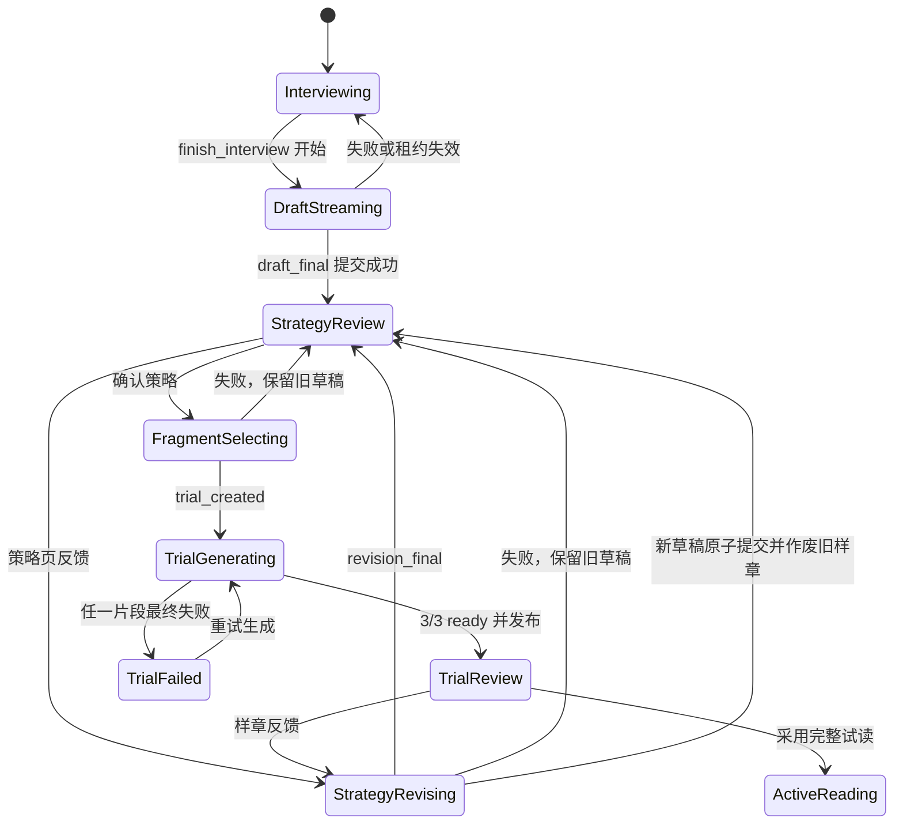

# 阅读准备与试读流程渐进式展示实施方案

> 本文件是一份可直接执行的实施规范，基于本地 `main` 的 `06fb00e` 状态整理。
> 符号名是实现定位的主要依据，行号只作为辅助参考。

## 0. 范围与目标

### 0.1 覆盖流程

本方案覆盖以下完整闭环：

```text
访谈最后一答
  -> 流式生成读前简报、临时策略、三个阅读节点
  -> 临时策略确认
  -> 流式确定三个试读切片
  -> 三段原文逐段出现
  -> 三段裁读结果逐段回填
  -> 样章确认或提交反馈
  -> 流式生成修订后的临时策略
  -> 再次确认并生成新一轮样章
```

同时覆盖策略确认页直接提交反馈的路径。策略页反馈和样章反馈必须复用同一套策略修订能力。

### 0.2 用户体验目标

1. 长时间模型调用开始后，页面在首个可识别工具调用事件到达时立即进入对应的渐进视图。
2. 用户不再等待整个工具调用、三个切片或三段裁读全部完成后才看到内容。
3. 三个试读槽位尺寸和顺序固定，状态从“定位中”逐步变成“原文已选”“裁读中”“完成”。
4. 单段裁读结果完成后，在已经展示的原文原地加入导读、裁读注和节后助读，不替换整页。
5. 样章反馈生成新策略期间，旧样章继续保持权威且可恢复；只有新策略成功提交后才作废旧样章。
6. 所有正式操作仍受持久化状态约束，临时流内容不能提前获得确认、采用或反馈权限。

### 0.3 非目标

1. 不做单个片段内部的 annotation token 级逐条落库。每个 worker 返回完整、校验通过的片段结果后再一次性回填该段。
2. 不改变正式策略创建时机。正式策略仍只在用户采用完整试读后创建。
3. 不允许只完成部分片段时采用策略。
4. 不把试读生成迁移进 reading setup agent；worker 仍负责裁读生成。
5. 不要求刷新后重放已经流过的每个字符。刷新恢复以持久化 operation 和权威快照为准。

## 1. 当前基线与主要阻塞点

### 1.1 访谈结束

- `finish_interview` 已经一次性产出本书画像、读前简报、公开策略和包含三个 `trial_candidates` 的结构化策略。
- `createInterviewStreamParser` 能识别 `finish_interview`，但不解析其参数，只在工具成功后发 `concluding`。
- API 会扣住 `concluding`，直到 interview session、画像和策略草稿在同一事务中提交成功。
- `InterviewPage` 只能展示固定的“正在生成读前简报”，提交完成后依赖 workflow gate 跳到策略页。
- `StrategySnapshot` 丢弃服务端已有的 `draft.strategy.trialCandidates`，刷新后无法展示已选阅读节点。

### 1.2 策略确认到试读

- `POST /strategy/approve` 会同步等待 `select_trial_fragments` 完整返回三个片段。
- 三个片段全部选完后，宿主才创建 trial revision、三个 trial segment 和三个 generation job。
- 因此切片阶段没有 revision，也没有三个可查询槽位；页面只能停留在策略按钮 loading。

### 1.3 试读生成

- revision 创建后，`trialState` 已经可以切出并返回三个片段的 `originalHtml`。
- API 在 revision 未 `published` 时故意隐藏每个 generation result。
- Web mapper 又在未发布时把 `samples` 直接映射为空数组。
- worker 实际上已经逐段写入 `node_generations.status=ready` 和完整 `result`，最后一段完成时才发布整个 revision。

### 1.4 样章反馈回跳

- `TrialPage` 提交反馈后会等待完整策略修订请求结束，成功后才跳转策略页。
- `reviseFromFeedback` 在模型调用成功前不修改旧 trial；成功后在一个事务中 supersede 旧 trial、保存新 draft、增加调整次数并回到 `strategy_review`。
- 该事务边界必须保留，但模型调用过程需要变成可观测的渐进流。
- 当前策略修订沿用原读前简报，只更新公开策略、结构化策略和可能变化的阅读节点。

## 2. 核心设计决策

### 2.1 区分临时展示与权威提交

所有来自 tool-call argument partial JSON 的内容都是 speculative：

- 可以立即展示；
- 不能写入正式草稿字段；
- 不能开放确认、反馈或采用按钮；
- 工具执行、业务校验或最终事务失败时必须可丢弃；
- 只有 `*_final` 事件携带的服务端快照才是权威数据。

### 2.2 保留现有业务工作流状态

不向 `userBooks.workflowStatus` 增加 `strategy_revising` 或 `trial_selecting`。

原因：

1. 这两个状态描述的是长请求运行状态，不是已经提交的业务阶段。
2. 样章反馈修订期间必须保持 `trial_review`，旧样章在新策略提交成功前仍有效。
3. 试读切片失败时必须保持 `strategy_review`，用户可以重新确认或继续修改策略。
4. 现有 workflow pointer check 和路由 gate 可以继续使用。

临时运行状态由 `reading_setup_operations` 和客户端渐进状态表达。

### 2.3 展示渐进，发布与采用仍然原子

把原来的“试读 all-or-nothing”拆成两条规则：

- 展示规则：三个原文和已经完成的单段裁读结果可以逐段展示。
- 业务规则：revision 发布、反馈入口、正式采用仍要求三个片段全部 ready。

相关 PRD、架构文档和 `core_flow_refactor.md` 中“不展示部分结果”的旧表述需要同步修改。

### 2.4 阅读节点与精确切片是两个阶段

- `finish_interview` / `save_strategy_draft` 选择的是恰好三个阅读节点。
- `select_trial_fragments` 只能在这三个节点内确定精确 block range，并补充 threshold / typical / hardest 标签。
- 策略页展示“已选阅读节点”；样章生成页展示“正在为这三个节点确定切片范围”。

### 2.5 样章反馈不重写读前简报

沿用当前行为：

- 首次访谈结束流式生成读前简报。
- 策略页反馈和样章反馈只修订公开策略、结构化策略及阅读节点。
- 临时策略修订视图直接显示旧简报，不对简报做 loading 或重新流式生成。

如果未来要允许反馈重写简报，应作为独立产品需求修改 agent schema 和持久化逻辑。

## 3. 目标状态流



其中 `DraftStreaming`、`StrategyRevising` 和 `FragmentSelecting` 是 UI/operation 状态，不进入 `userBooks.workflowStatus`。

## 4. 长操作持久化与租约

### 4.1 新表 `reading_setup_operations`

新增一张只记录策略修订和试读切片命令的表。访谈 turn 继续使用现有 `interview_sessions.turnLease*`。

建议字段：

```text
id                              uuid primary key
user_book_id                    uuid not null
kind                            strategy_revision | trial_selection
source                          strategy_feedback | trial_feedback | strategy_approve
base_strategy_draft_version_id  uuid not null
base_trial_revision_id          uuid null
idempotency_key                 text not null
request_hash                    text not null
payload                         jsonb not null
status                          pending | running | completed | failed
attempt_count                   integer not null default 0
lease_id                        uuid null
lease_claimed_at                timestamptz null
lease_expires_at                timestamptz null
result_strategy_draft_version_id uuid null
result_trial_revision_id        uuid null
error_summary                   text null
created_at                      timestamptz not null
updated_at                      timestamptz not null
completed_at                    timestamptz null
```

约束与索引：

1. `unique(user_book_id, idempotency_key)`，保证同一客户端命令只产生一个 operation。
2. 每本书最多一个 `pending/running` operation 的 partial unique index。
3. lease 四字段必须全空或全有。
4. `completed` 必须至少存在一个结果 pointer。
5. `failed` 必须有 `error_summary`。
6. `trial_feedback` 必须绑定 `base_trial_revision_id`。
7. `trial_selection` 的 source 必须是 `strategy_approve`。
8. 幂等重放时必须重新计算 `request_hash`；同一个 key 绑定了不同 feedback、base draft 或 base trial 时返回 409。

### 4.2 为什么需要 operation

SSE 连接可能在模型调用期间断开。若只依赖浏览器 mutation 状态：

- 刷新后无法知道策略修订或切片是否仍在运行；
- 用户可能重复提交相同反馈；
- 两个请求可能并行调用模型，最终只有一个 CAS 提交成功；
- 无法在 lease 过期后安全恢复。

operation 只持久化命令状态和最终 pointer，不持久化每个字符。正常连接看到完整流；刷新后看到 skeleton，并通过 operation 状态等待最终快照或在 lease 过期后恢复。

### 4.3 operation 生命周期

1. 端点先完成权限、workflow、base draft/trial 和输入校验。
2. 按 idempotency key 插入或读取 operation。
3. `pending/failed` 或过期 `running` operation 可以原子 claim 新 lease。
4. 当前有效 lease 的请求负责调用 agent。
5. 最终业务事务使用 `operation.id + lease_id + base pointers` 作为 fencing 条件。
6. 成功事务同时写业务结果和 `operation=completed`。
7. 模型或校验失败只把 operation 标记为 failed，不修改当前 draft/trial pointers。
8. 重放已 completed operation 时直接返回最终快照，不重复调用模型。

### 4.4 恢复查询

新增：

```text
GET /v1/user-books/:id/reading-setup-operation/active
```

返回当前 operation 的公开摘要：

```ts
{
  operationId: string;
  kind: 'strategy_revision' | 'trial_selection';
  source: 'strategy_feedback' | 'trial_feedback' | 'strategy_approve';
  status: 'pending' | 'running' | 'completed' | 'failed';
  baseDraftId: string;
  baseTrialRevisionId: string | null;
  resultDraftId: string | null;
  resultTrialRevisionId: string | null;
  canResume: boolean;
  errorSummary: string | null;
}
```

页面刷新后不重放字符：

- `running`：展示相应 skeleton 并轮询 operation/detail。
- `canResume`：自动调用对应 resume stream。
- `completed`：读取权威 strategy/trial snapshot 并按 workflow 跳转。
- `failed`：恢复旧页面和原输入，允许重试。

## 5. Agent 增量解析

### 5.1 重构 parser

将 `createInterviewStreamParser` 扩展为按工具分发的 `createReadingSetupStreamParser`，继续复用 `completeJson`。

支持工具：

| 工具 | 增量字段 |
|---|---|
| `present_interview_question` | acknowledgment、prompt、hint、options、sufficiency |
| `finish_interview` | briefing 四段、public_strategy、strategy.trial_candidates |
| `save_strategy_draft` | public_strategy、strategy.trial_candidates |
| `select_trial_fragments` | fragments 数组中的完整 fragment |

### 5.2 调整 `finish_interview` 字段顺序

当前隐藏的本书画像位于用户可见字段之前。工具参数顺序调整为：

```text
briefing
public_strategy
strategy
book_reader_profile
reader_profile_patch
```

parser 不能只依赖字段顺序判断正确性，但顺序用于降低首个可见内容的延迟。

### 5.3 安全增量规则

1. 字符串只发新增后缀，不能重复发送已经发出的字符。
2. briefing 按四个固定 field 分别维护已发长度。
3. candidate/fragment 只有对象字段完整后才能发送，禁止发送截断的 reason、range 或 label。
4. `trial_candidates` 和 `fragments` 只能按 ordinal 递增发送。
5. parser 在 tool name 缺失时可由字段推断，但推断后必须锁定当前工具。
6. 一个新 tool call 开始时必须重置 buffer 和 emitted state。
7. 工具执行失败不发送 final 事件；已经发送的临时内容由客户端在 error 时丢弃。

### 5.4 内部事件

建议将 agent-kit 的内部事件定义为：

```ts
type ReadingSetupStreamDelta =
  | ExistingInterviewQuestionDeltas
  | { type: 'draft_started'; source: 'interview' | 'revision' }
  | { type: 'briefing_delta'; field: BriefingField; chars: string }
  | { type: 'strategy_delta'; chars: string }
  | { type: 'reading_node_added'; ordinal: number; sectionId: string; segment: number; reason: string }
  | { type: 'selection_started'; total: 3 }
  | { type: 'fragment_added'; ordinal: number; fragment: TrialFragmentSelection };
```

agent-kit 只发送 agent 原始业务字段。chapter path、原文 HTML、operation id 和权威 snapshot 由 API/service 层补充。

## 6. 对外 SSE 契约

所有非 heartbeat 事件都应携带单调递增的 `sequence`，并绑定 `userBookId` 以及当前
`streamId`，或 `operationId + operationAttempt`。客户端用该 envelope 去重和拒绝迟到事件；下面示例省略重复字段时，
仍视为包含这些公共字段。

### 6.1 首次访谈结束

扩展现有 `InterviewStreamEvent`：

```ts
| { type: 'draft_started'; streamId: string; conversationVersion: number }
| { type: 'briefing_delta'; streamId: string; field: BriefingField; chars: string }
| { type: 'strategy_delta'; streamId: string; chars: string }
| { type: 'reading_node_added'; streamId: string; node: ReadingNodePreview }
| { type: 'draft_final'; streamId: string; strategy: StrategyReviewResponse }
```

语义：

- `draft_started` 在识别到 `finish_interview` tool call 时立即发送。
- `draft_final` 只在 interview lease fencing 和保存草稿事务成功后发送。
- `done` 仍作为 turn 结束帧，但客户端以 `draft_final` 的 snapshot 填充策略缓存。
- `concluding` 可以保留兼容，后续在前端迁移完成后删除或降为纯文案事件。

### 6.2 策略修订流

新增共享事件类型 `StrategyRevisionStreamEvent`，由策略页反馈和样章反馈共同使用：

```ts
type StrategyRevisionStreamEvent =
  | {
      type: 'revision_started';
      operationId: string;
      source: 'strategy_feedback' | 'trial_feedback';
      baseDraftId: string;
      baseTrialRevisionId: string | null;
    }
  | { type: 'strategy_delta'; operationId: string; chars: string }
  | { type: 'reading_node_added'; operationId: string; node: ReadingNodePreview }
  | { type: 'revision_final'; operationId: string; strategy: StrategyReviewResponse }
  | { type: 'error'; operationId?: string; message: string };
```

端点建议采用 additive 迁移：

```text
POST /v1/user-books/:id/strategy/feedback/stream
POST /v1/user-books/:id/trial/feedback/stream
POST /v1/user-books/:id/reading-setup-operation/:operationId/resume
```

旧 JSON 端点保留到 Web 完成迁移，再单独删除。

### 6.3 试读切片流

新增：

```text
POST /v1/user-books/:id/strategy/approve/stream
```

请求增加客户端 `idempotencyKey`。事件：

```ts
type TrialSelectionStreamEvent =
  | {
      type: 'selection_started';
      operationId: string;
      draftId: string;
      slots: Array<{ ordinal: 1 | 2 | 3; tag: TrialFragmentTag }>;
    }
  | {
      type: 'fragment_selected';
      operationId: string;
      draftId: string;
      sample: ProvisionalTrialSample;
    }
  | {
      type: 'trial_created';
      operationId: string;
      draftId: string;
      trial: TrialReviewResponse;
    }
  | { type: 'error'; operationId?: string; message: string };
```

`fragment_selected` 必须在 API 层完成以下校验和转换后才能发给客户端：

1. 节点属于当前 draft 的三个候选节点。
2. 节点 `tailoring_eligible=true`。
3. range 落在该节点实际 blocks 内且非空。
4. 与此前已发送片段不重复。
5. threshold、typical、hardest 三种 tag 各出现一次，并固定映射到 1/2/3 槽位。
6. 根据 range 切出 `originalHtml`。
7. 解析 `chapterPath` 和选择原因。

三个 fragment 全部有效且 agent 工具成功后，才创建 revision 并发送 `trial_created`。

### 6.4 `ReadingNodePreview` 与候选节点持久显示

新增前后端共用的用户可读投影：

```ts
interface ReadingNodePreview {
  ordinal: number;
  sectionId: string;
  segment: number;
  chapterPath: string[];
  reason: string;
}
```

`StrategyReviewResponse` 增加 `trialCandidatePreviews`。`strategyState` 根据 manifest 将持久化 candidate 映射成该结构，保证刷新后的策略页仍能显示三个节点。

## 7. API 与 service 改造

### 7.1 访谈 turn

1. `ReadingSetupEngine.runTurn.onStream` 类型扩展为 `ReadingSetupStreamDelta`。
2. `generateNextQuestion` 继续过滤需要提交后才能发送的 final 事件，但不再屏蔽 draft 的临时增量。
3. service 在开始 turn 前加载 candidate preview 所需的 manifest title map。
4. 收到 agent `reading_node_added` 后补 chapter path 再发送公开 SSE。
5. `saveSetupOutcome` 成功后读取 `strategyState`，发送 `draft_final`。
6. `POST /interview/resume` 增加流式版本，使 lease 过期恢复时也能继续收到 draft/question 增量。

### 7.2 策略修订

把 `reviseFromFeedback` 拆成三个层次：

```text
validateRevisionCommand
runRevisionAgentStream
commitRevisionOutcome
```

- `validateRevisionCommand` 检查当前 workflow、base draft、base trial、调整上限和 idempotency operation。
- `runRevisionAgentStream` claim operation lease，运行 `phase=strategy_review` 并发送临时事件。
- `commitRevisionOutcome` 保留当前事务语义，并在同一事务中完成 operation。

样章反馈提交成功时仍必须原子完成：

1. old trial revision -> superseded；
2. old trial generations -> superseded/result null；
3. old draft -> superseded；
4. insert new draft；
5. record feedback message；
6. adjustment count +1；
7. user book -> strategy_review，currentTrialRevisionId=null；
8. operation -> completed，写 result draft id。

任何一步失败都不允许部分提交。

其中第 2 步必须通过 `trial_segments.trialRevisionId` 精确定位来源 revision 的 generation，
不能只按 `userBookId + generationScope=trial` 批量 supersede，避免影响其他历史或并发版本。

### 7.3 试读切片与 revision 创建

把 `approveStrategy` 拆成：

```text
validateSelectionCommand
runTrialSelectionAgentStream
commitTrialRevision
enqueueTrialGenerations
```

- agent 调用前不修改 draft status 和 workflow。
- `fragment_selected` 是临时事件，不等于已经存在 trial segment。
- `commitTrialRevision` 继续在一个事务中批准 draft、创建 revision/segments/generations、推进 workflow，并完成 operation。
- 入队失败沿用当前失败事务，将 revision 和 segments 标记 failed。
- 重放 completed operation 时直接返回 `trial_created` 和当前 trial snapshot。

### 7.4 Trial 状态投影

修改 `trialState`：

1. 所有 revision 状态都返回三个 segment 的 `originalHtml`。
2. 当对应 generation `status=ready` 时返回该段 `result`，不再要求 revision 已 published。
3. segment status 取 trial segment 和 generation 的一致投影。
4. `canAdopt` 仍要求 revision published 且 3/3 ready。
5. 返回 revision id、draft id 和每个 segment id，供前端拒绝迟到事件。

### 7.5 Worker 状态

worker 抢到 generation 并将 `node_generations` 改为 generating 时，同时把对应 `trial_segments.status` 从 pending 改为 generating。

完成时沿用：

- generation ready + result；
- segment ready；
- 最后一段完成后锁 revision、检查 3/3、publish revision；
- user book 进入 trial_review。

失败时保留已经完成段的可展示 result，整轮进入 failed，采用和反馈按钮保持禁用。重试会创建新 revision，不能复用旧 revision 的 UI 状态。

worker 在最终写入 ready/result 和尝试 publish 前必须重新校验：

- generation 仍绑定当前 trial segment 和 strategy draft；
- trial revision 仍处于 generating；
- user book 的 `currentTrialRevisionId` 仍等于该 revision；
- draft 仍是该 revision 使用的 `approved_for_trial` 版本。

迟到任务不允许发布旧 revision，应改为 superseded 或直接停止写回。

## 8. 前端状态与组件设计

### 8.1 共享渐进组件

新增可由多个页面复用的无路由组件：

```text
ProgressiveStrategyView
  - PartialBriefCard
  - ProgressiveStrategySummary
  - ReadingNodeSelectionList
  - StrategyActionArea

ProgressiveTrialView
  - TrialSlotNavigation
  - TrialSampleStage
  - TrialSegmentStatus
  - TrialActionArea
```

`StrategyPage`、`InterviewPage` 和 `TrialPage` 不各自复制一套展示结构。

策略正文流式增长时先使用 `white-space: pre-wrap` 的纯文本渲染；final snapshot 到达后再切换到
`AssistanceContent` 的 Markdown 渲染，避免半截 Markdown 在每个 token 上反复改变块结构。

### 8.2 `ProgressiveStrategyView` 输入

```ts
interface ProgressiveStrategyModel {
  mode: 'streaming' | 'committed';
  source: 'interview' | 'strategy_feedback' | 'trial_feedback';
  briefing: Partial<Briefing>;
  strategySummary: string;
  nodes: ReadingNodePreview[];
  draftVersion?: number;
  error?: string;
}
```

行为：

- 首次访谈结束：四个 briefing section 固定出现，逐段填充。
- 策略/样章反馈：直接显示完整旧 briefing，只流式替换策略和节点。
- streaming 模式隐藏或禁用反馈/确认按钮。
- final snapshot 到达时用权威内容一次校正临时文本，避免 partial parser 与最终模型 JSON 的细微差异。

### 8.3 InterviewPage

`StreamState` 扩展为 discriminated state：

```text
question_streaming
draft_streaming
idle
error
```

- `draft_started` 到达时，访谈对话区域原地切换到 `ProgressiveStrategyView`。
- 不立即 navigate；workflow 仍是 interviewing。
- `draft_final` 到达时写入 `['user-book', id, 'strategy']`，再 invalidate detail。
- workflow gate 切到 `/strategy` 后，策略页直接从缓存渲染，不能再次显示整页 loading。
- 刷新时若 interview `turnInProgress=true` 且没有 currentQuestion，显示策略/下一步通用 skeleton；如果 operation 最终提交，detail polling 会触发路由切换。

### 8.4 StrategyPage

普通展示使用 committed `ProgressiveStrategyView`。

提交策略反馈时：

- 保留当前 committed snapshot；
- 在同页进入 revision streaming；
- briefing 保持；
- strategy summary 清空并流式重建；
- node list 清空并逐个加入；
- 失败时恢复原 snapshot 和反馈文本；
- final 时替换 strategy query cache，清空反馈。

点击确认时：

- 立即切换为 `ProgressiveTrialView` 的三个 provisional slot；
- slot 初始状态为 selecting；
- `fragment_selected` 到达时该 slot 显示 chapter path、reason 和 originalHtml，状态变成 selected；
- `trial_created` 到达时写入 trial cache，invalidate detail 并 navigate `/trial`。

### 8.5 TrialPage

`TrialSample` 改为包含：

```ts
interface TrialSample {
  id: string;
  ordinal: number;
  status: 'pending' | 'generating' | 'ready' | 'failed';
  chapterPath: string[];
  selectionReason: string;
  originalHtml: string;
  tailoredContent: TailoredContent | null;
  viewedAt: string | null;
}
```

`mapTrial` 不再根据 published 决定是否创建 samples。三个 samples 始终存在。

渲染规则：

| segment 状态 | 页面表现 |
|---|---|
| pending | 显示原文，状态“等待裁读” |
| generating | 显示原文，状态“正在生成导读与裁读注” |
| ready | 用 annotations 重新计算原文 HTML，并显示 guide/afterReading |
| failed | 保留原文，显示该段失败状态；全局提供整轮重试 |

`prepareStandaloneContent` 继续负责把 annotations 注入原文。原文容器保持同一个 React 节点和稳定尺寸，result 到达时只更新内部 HTML 和辅助内容。

注释、导读和节后助读加入前记录当前可见 block/字符锚点，更新 DOM 后复用或抽取
`readerLayoutAnchor` 的布局补偿能力恢复窗口位置；同时关闭基于旧 DOM anchor 的 annotation popover，
避免用户正在阅读时因结果到达而发生明显滚动跳跃。

trial query 在 generating 期间将轮询间隔从 1800ms 调整到约 800-1200ms，并使用当前 GET 快照恢复。若后续引入 worker 事件总线，再把轮询替换为 trial SSE，不影响页面状态模型。

### 8.6 样章反馈回临时策略

提交反馈时不立刻清除 trial query：

1. 保存 committed trial snapshot 和 feedback 文本。
2. 原地切换到 `ProgressiveStrategyView(source=trial_feedback)`。
3. briefing 使用当前 draft 的完整 briefing。
4. 新策略和新阅读节点流式出现。
5. error 时恢复原 trial snapshot，feedback 保留。
6. `revision_final` 时才移除旧 trial query、写入新 strategy query、invalidate detail 并 navigate `/strategy`。

这保证模型失败或 operation lease 丢失时，用户不会失去旧样章。

### 8.7 React Query 与迟到事件隔离

建议 query key：

```text
['user-book', id]
['user-book', id, 'interview']
['user-book', id, 'strategy', draftId]
['user-book', id, 'trial', trialRevisionId]
['user-book', id, 'reading-setup-operation']
['user-book', id, 'strategy-progress', operationOrStreamId]
['user-book', id, 'trial-selection-progress', operationId]
```

另保留 current pointer query 或 key factory，根据 user-book detail 中的
`currentStrategyDraftVersionId/currentTrialRevisionId` 指向精确版本缓存，避免旧请求覆盖新版本。

每个 reducer/event handler 必须校验：

- userBookId；
- streamId 或 operationId；
- 单调递增的 event sequence；
- baseDraftId；
- baseTrialRevisionId；
- trialRevisionId。

不匹配的迟到事件直接忽略。新 revision 到达时清空旧 provisional slots、sampleIndex 和 annotation popover。

## 9. 失败、断线与并发行为

### 9.1 首次策略生成失败

- 已提交的最后一答保留。
- interview lease 显式释放或等待过期。
- 页面显示生成失败和恢复入口。
- resume stream 重新运行该 turn。
- 未提交的 briefing/strategy 临时内容全部丢弃。

### 9.2 策略修订失败

- 当前 draft 或 published trial 不变。
- adjustment count 不增加。
- operation failed，记录可读 error summary。
- 页面恢复原策略/样章，用户输入不清空。

### 9.3 试读切片失败

- draft 保持 draft，不写 approvedForTrialAt。
- currentTrialRevisionId 仍为空。
- 已展示的 provisional 原文全部丢弃。
- operation failed，用户可重试确认或继续修改策略。

### 9.4 单段生成失败

- 其他已完成片段继续展示。
- revision 进入 failed，采用和反馈入口禁用。
- 重试创建新 revision；旧 revision 的 ready result 不能进入新 cache。
- 技术重试不增加 adjustment count。

### 9.5 连接中断

- 服务端已经取得有效 lease 时继续完成当前模型调用和最终提交，不因浏览器关闭立即取消业务命令。
- 客户端重新进入页面后读取 active operation 或 interview turn 状态。
- 不重放字符流；显示 skeleton，等待 completed pointer 或在 lease 过期后 resume。
- 所有 GET 快照都是恢复真源，SSE 只优化实时体验。

### 9.6 多标签页与重复提交

- 同一 idempotency key 返回同一 operation。
- 同一 key 但 request hash 不同返回 409，不能把旧结果当作新反馈的成功响应。
- 不同 idempotency key 受“每本书一个 active operation”约束。
- 最终事务继续检查 current draft/trial pointers 和 operation lease fencing token。
- 409 后客户端统一 invalidate detail、strategy、trial 和 active operation。

## 10. 分阶段实施顺序

### 阶段 A：契约、parser 与 operation 基础设施

1. 新增 `reading_setup_operations` migration/schema。
2. 新增 operation contract、公开 preview 类型和 SSE unions。
3. 扩展 agent stream parser，补齐逐字符和逐对象测试。
4. 实现 operation claim/release/complete/resume service。
5. 暂不改现有页面行为。

验收：旧 API 和 Web 行为保持不变，新 parser/operation 测试通过。

### 阶段 B：首次访谈结束渐进策略

1. 调整 `finish_interview` 字段顺序。
2. 扩展 interview SSE。
3. 增加 `ProgressiveStrategyView` 和 partial briefing。
4. InterviewPage 原地 morph，final snapshot 无闪烁切页。
5. 增加流式 resume 路径。

验收：最后一答后首个 tool call 出现即开始显示简报，最终提交前按钮不可用。

### 阶段 C：策略修订统一流

1. 抽出 revision service 三层结构。
2. 新增策略反馈和样章反馈 stream endpoints。
3. StrategyPage 接入流式修订。
4. TrialPage 接入反馈回临时策略，并实现失败恢复旧样章。

验收：两个入口共享同一协议；样章反馈失败不会作废旧样章或增加调整次数。

### 阶段 D：试读切片流

1. select_trial parser 逐个发 fragment。
2. 新增 approve stream 和 trial selection operation。
3. API 校验并切出 provisional originalHtml。
4. StrategyPage 原地进入三槽位 Trial View。
5. final 事务创建 revision 后无闪烁进入 TrialPage。

验收：三个原文随 fragment 完成依次出现；切片失败时回到原策略。

### 阶段 E：逐段裁读结果展示

1. worker 设置 segment generating。
2. API 按单 generation ready 暴露 result。
3. Web generating 期间保留 samples。
4. TrialPage 原地加入 annotations/guide/afterReading。
5. 更新 failed/retry 和版本隔离。

验收：任一片段完成后立即更新该段；采用按钮只在 3/3 published 后出现。

### 阶段 F：清理与文档

1. 删除已不再使用的同步 feedback/approve 路径。
2. 清理 `concluding` 兼容逻辑和旧 all-or-nothing UI 文案。
3. 更新 PRD、agent design、technical architecture 和 core flow refactor。
4. 补齐可观测性指标和运行手册。

## 11. 建议提交拆分

遵循“一个提交一个需求”原则：

1. `feat(setup): add persistent reading setup operations`
2. `feat(agent): stream strategy drafts and trial fragments`
3. `feat(interview): render the final setup draft progressively`
4. `feat(strategy): stream strategy revisions from both feedback sources`
5. `feat(trial): stream fragment selection into stable preview slots`
6. `feat(trial): expose and render per-segment generation results`
7. `docs(core-flow): define progressive display and atomic adoption`

每个提交包含对应测试，不把无关重构混入。

## 12. 测试方案

### 12.1 agent-kit

- `finish_interview` 在 1 字符、随机长度和字段边界 chunk 下完整还原四段 briefing、公开策略和三个节点。
- `save_strategy_draft` 不发送 briefing delta，只发送策略和节点。
- `select_trial_fragments` 不发送截断 range/reason，对三个完整对象各发送一次。
- tool name 缺失时可以推断工具。
- tool execution error 不产生 final。
- 新 tool call 正确重置 emitted state。

### 12.2 contracts

- 所有新 SSE event discriminator 和 payload 校验。
- `ReadingNodePreview`、operation response、provisional sample 校验。
- Trial response 在 generating/failed 时允许 segment result 为 ready 或 null。
- 仍要求恰好三个 trial segments。

### 12.3 API/service

- SSE 开流前的 stale draft/trial/feedback 校验仍返回 HTTP 4xx。
- 开流后的模型失败变成带内 error。
- operation 同 idempotency key 重放不重复调用 agent。
- active lease 阻止第二个 operation；过期 lease 可以 reclaim。
- 旧 lease 不能提交结果。
- 样章反馈模型失败时旧 trial 仍 published/current。
- 样章反馈成功时旧 trial、generation、draft、新 draft、adjustment count 和 operation 在同一事务提交。
- fragment 只有范围校验成功后才发公开事件。
- trialState 在 revision generating 时返回原文，并只对 ready generation 返回 result。
- published/canAdopt 仍要求 3/3 ready。

### 12.4 worker

- generation 开始时 segment 从 pending 进入 generating。
- 单段 ready 后 result 可查询，但 revision 尚未发布。
- 最后一段 ready 后只发布一次 revision。
- 任一段最终失败时 revision failed，其他 ready result 保留用于展示。

### 12.5 Web

优先把流状态归约为纯 reducer 并做单元测试，再补关键组件 render test：

- 最后一答的 question stream 可以切换成 draft stream。
- partial briefing section 按到达顺序填充且布局稳定。
- final snapshot 校正临时文本并开放按钮。
- strategy feedback error 恢复旧 snapshot 和输入。
- trial feedback error 恢复旧样章和输入。
- 三个 provisional slot 顺序固定，fragment 可以乱速完成但按 ordinal 落位。
- pending/generating/ready/failed 的样章渲染正确。
- ready result 到达后 annotation anchor 出现在原文中。
- 旧 operation/revision 的迟到事件被忽略。
- 409 会清理临时状态并重新同步权威数据。

### 12.6 技术检查

每个阶段至少运行：

```text
pnpm typecheck
pnpm test:ts
pnpm build
```

涉及 migration 时额外验证迁移顺序、schema snapshot 和空库升级。

## 13. 手工验收清单

项目 owner 负责 UI 与交互验收。需要覆盖：

1. 正常访谈最后一答：简报、策略、三个节点的出现顺序和首内容延迟。
2. 访谈生成中刷新：显示恢复 skeleton，完成后进入正确策略版本。
3. 策略页反馈成功/失败/重复提交。
4. 首次确认：三个槽位立即出现，三个原文按 agent 返回顺序填充。
5. 三段生成速度不同：先完成的片段先出现注释，未完成片段原文仍可查看。
6. 单段失败：其他片段保留，采用入口不可用，重试进入全新 revision。
7. 样章反馈：立即进入临时策略，失败回原样章，成功进入新 draft。
8. 修订策略再次确认：旧 trial 的迟到结果不会污染新 trial。
9. 多标签页、刷新、网络断开恢复。
10. 调整次数达到上限后的按钮和文案。

## 14. 可观测性

新增指标：

- `setup_stream.first_visible_delta_ms`
- `setup_stream.duration_ms`
- `setup_operation.kind/source/status`
- `setup_operation.lease_reclaimed`
- `strategy_revision.commit_ms`
- `trial_selection.first_fragment_ms`
- `trial_selection.complete_ms`
- `trial_generation.segment_ready_ms`，按 ordinal 记录
- `trial_generation.all_ready_ms`
- SSE disconnect 与 resume 次数

日志必须包含 operationId、streamId、userBookId、baseDraftId 和 trialRevisionId，但不能记录完整原文、完整策略或用户反馈正文。

## 15. 主要风险与控制

### 15.1 partial JSON 错误展示

控制：字符串只 diff 后缀；对象必须完整；API 再做业务校验；final snapshot 强制校正。

### 15.2 临时内容与提交结果不一致

控制：明确 speculative 标识；操作按钮禁用；只以 final snapshot 写业务 query cache。

### 15.3 旧版本结果混入新版本

控制：所有事件绑定 operation/base draft/trial revision；客户端 reducer 严格检查；worker/API 继续使用 revision pointer 和 superseded 状态。

### 15.4 operation 增加实现复杂度

控制：operation 只覆盖策略修订和试读切片，不替代业务表；不存字符事件；复用 interview lease 的 claim/fencing 模式。

### 15.5 generating 期轮询负载

控制：只在 `trial_generating` 时使用约 1 秒间隔，页面隐藏或连接空闲时退避；后续可用 worker notification 唤醒替换轮询，前端模型不变。

## 16. 完成定义

以下条件全部满足才视为完成：

1. 首次访谈结束、策略反馈、样章反馈和试读切片都有真实 agent 增量事件。
2. 三个试读原文可以在裁读前展示。
3. 每段完整裁读结果 ready 后独立展示。
4. 正式发布、反馈和采用权限仍严格依赖权威状态。
5. 样章反馈失败不会破坏旧样章。
6. 重复提交、断线、过期 lease 和迟到事件都有确定行为。
7. 刷新后可以通过权威快照或 operation 恢复，不产生重复业务版本。
8. 自动测试、typecheck 和 production build 全部通过。
9. PRD 与架构文档不再把“禁止部分采用”和“禁止部分展示”混为一条规则。
